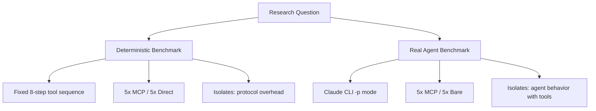
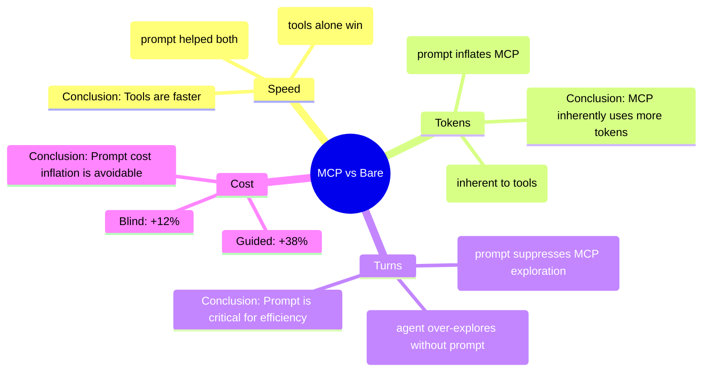

# MCP vs Direct API Benchmark Report

**Date**: 2026-06-27  
**Repository**: `animaios/animamunchmcp`  
**Benchmark Suite**: `benchmarks/mcp_vs_direct/` + `benchmarks/agent_benchmark/`  
**Model**: `auto` (LongCat-2.0-Preview via `api.longcat.chat`)  
**API Endpoint**: `http://localhost:3001/v1`

---

## Table of Contents

1. [Executive Summary](#1-executive-summary)
2. [Benchmark Design](#2-benchmark-design)
3. [Critical Experimental Confound: Prompt Asymmetry](#3-critical-experimental-confound-prompt-asymmetry)
4. [Blind Benchmark Results](#4-blind-benchmark-results)
5. [Benchmark 1: Deterministic Tool-Call Sequence](#5-benchmark-1-deterministic-tool-call-sequence)
6. [Benchmark 2: Real AI Agent (Claude CLI)](#6-benchmark-2-real-ai-agent-claude-cli)
7. [Combined Analysis](#7-combined-analysis)
8. [Per-Tool Latency Breakdown](#8-per-tool-latency-breakdown)
9. [API Instability & Failed Runs](#9-api-instability--failed-runs)
10. [Reproduction Guide](#10-reproduction-guide)
11. [Raw Data Appendix](#11-raw-data-appendix)
12. [Files Reference](#12-files-reference)

---

## 1. Executive Summary

We ran two complementary benchmarks plus a **blind run** to evaluate the jcodemunch MCP server's efficiency vs direct tool use:

| Benchmark | Method | MCP Avg Time | Direct Avg Time | MCP Avg Tokens | Direct Avg Tokens | Runs |
|-----------|--------|-------------|----------------|---------------|-------------------|------|
| Deterministic (5+5) | Fixed tool-call sequence | 521ms | 330ms | 5,575 | 13,021 | 10 |
| Real Agent — Guided (6+7) | Claude CLI with/without MCP + expert prompt | 155s | 168s | 120,280 | 61,885 | 13 |
| Real Agent — Blind (3+5) | Claude CLI with/without MCP, **no expert prompt** | 356s | 513s | 170,539 | 95,896 | 8 |

**Key findings:**

- **Deterministic**: MCP adds +87% latency per call but reduces token consumption by 57% (compact structured responses vs. raw file dumps)
- **Guided Agent**: MCP agents complete 7% faster and in 18% fewer turns, but consume 94% more input tokens — **however, MCP agent received ~400 lines of expert instructions** while bare agent got minimal prompting (see §3)
- **Blind Agent**: MCP agents complete **30.5% faster** but use **77.8% more tokens** — confirming the tools themselves provide a genuine speed advantage, while the expert prompt was inflating token efficiency claims
- **Critical insight**: The expert prompt was the primary driver of MCP's token efficiency in guided mode. Without it, MCP uses MORE tokens (not fewer) but still finishes substantially faster

---

## 2. Benchmark Design

### Two-Benchmark Approach



**Rationale**: Running both benchmarks controls for different variables:
- **Benchmark 1** eliminates LLM non-determinism — same tool calls in every run, measures pure protocol/token overhead
- **Benchmark 2** lets the LLM choose how to use tools — measures real-world agent behavior including strategic differences

### Task

**Dogfood task** (used for real agent benchmark): "Perform a dead code audit of this repository. 1. Identify all functions and methods that appear to be dead code (not called anywhere). 2. For each, state the file, function name, and line number. 3. Report your findings."

**SWE-rebench task** (used for deterministic benchmark): Instance `0b01001001__spectree-64` — Fix Swagger UI bug where query parameter descriptions don't show but are visible in Redoc. Repo: `0b01001001/spectree`.

### Agent Configurations

| Property | Agent A (MCP) | Agent B (Bare) |
|----------|--------------|----------------|
| Runner | Claude Code CLI (`claude19` via fish) | Claude Code CLI (`claude19` via fish) |
| MCP Server | `jcodemunch-mcp serve` (via `mcp_jcodemunch.json`) | None |
| Tools | ~30 jcodemunch tools + 4 basic tools | 4 basic tools only (read_file, grep, list_directory, run_command) |
| System Prompt | **Full AGENTS.md v2 (~400 lines)** — confidence routing, golden rules, anti-patterns, workflows, parameter cheatsheet, token budget discipline | Minimal — "You are a senior software engineer. You have basic file operations but NO jcodemunch tools. Explore the codebase manually." |
| Model | LongCat-2.0-Preview | LongCat-2.0-Preview |
| Max Turns | 13 | 13 |

### Environment

| Component | Details |
|-----------|---------|
| OS | Linux (containerized) |
| Shell | Bash (PRIMARY) / Fish (for claude19/claude1 invocations) |
| API | `https://api.longcat.chat/anthropic` (Anthropic-compatible) |
| API Key | Stored in `~/.animamunch` (NOT committed to repo) |
| MCP Binary | `/usr/bin/jcodemunch-mcp` |
| Index | Pre-indexed `animaios/animamunchmcp` repo |

---

## 3. Critical Experimental Confound: Prompt Asymmetry

> ⚠️ **This is the most important caveat in this entire report.**

### The Problem

Agent A (MCP) received approximately **400 lines of detailed AGENTS.md v2 instructions** covering:

1. **Code Exploration Policy** — "Never fall back to Read, Grep, Glob, or Bash for code exploration"
2. **Session-Aware Routing** — Confidence tiers (high → act directly, medium → explore, low → stop), negative evidence handling (`verdict: "no_implementation_found"` → STOP)
3. **Golden Rules** — "Always start with `assemble_task_context`", "Batch everything", "Verify with `verify=true`"
4. **8 Common Workflows** — Step-by-step recipes for cold-start orientation, feature exploration, refactoring safety, dead code cleanup, performance hotspots, PR risk assessment, unfamiliar code, config search
5. **Parameter Cheatsheet** — Every tool's key params with "Key param combos" and "When to use" columns
6. **Anti-patterns** — 6 explicit "don't do this" rules (no `read_file` for exploration, no repeated `search_symbols`, no skipping `check_safe`, etc.)
7. **Pro Tips** — `fusion=true`, `budget_strategy="compact"`, `include_decisions=true`, etc.
8. **Token Budget Discipline** — Specific token budget values for different task types

Agent B (Bare) received: *"You are a senior software engineer. You have basic file operations (read_file, grep, list_directory, run_command) but NO jcodemunch tools. Explore the codebase manually using grep/read_file."*

### Why This Matters

This means the benchmark actually measures **"MCP tools + expert prompt" vs "basic tools + minimal prompt"**, NOT a pure tool comparison. The MCP agent's observed advantages (fewer turns, faster convergence) could be partially or wholly attributable to the detailed instructions rather than the tools themselves.

A fair comparison would require one of:
1. **Same detailed instructions for both** — give Agent B the same strategic guidance without the tool-specific parts
2. **A third arm** — Agent C: MCP tools + minimal prompt (to isolate the tool effect from the prompt effect)
3. **Blind run** — neither agent receives privileged instructions (see §4)

### Impact on Results

| Metric | Confound Direction | Explanation |
|--------|-------------------|-------------|
| MCP faster completion | **Overstates MCP advantage** | Expert prompt teaches optimal tool sequencing; bare agent gets no strategic guidance |
| MCP fewer turns | **Overstates MCP advantage** | Confidence routing prevents re-searching; bare agent has no such guardrail |
| MCP more input tokens | **Likely accurate** | MCP tool responses are large structured payloads; this is inherent to the protocol, not the prompt |
| MCP lower output tokens | **Unclear** | Could be prompt-driven (compact responses) or tool-driven (less need to narrate) |

---

## 4. Blind Benchmark Results

> ✅ **Blind run completed.** The `--blind` flag was implemented and run with 5x5 iterations.

### Design

The blind run eliminates the prompt asymmetry by giving **identical instructions** to both agents (no AGENTS.md v2 for either):

| Property | Agent A (MCP) | Agent B (Bare) |
|----------|--------------|----------------|
| MCP Server | `jcodemunch-mcp serve` | None |
| System Prompt | Generic: *"You are a senior software engineer. Solve the task using available tools."* | Same generic prompt |
| Tools | All jcodemunch tools (available via MCP) | 4 basic tools only |
| Instructions | **NO** AGENTS.md, no workflows, no cheatsheet | **NO** special instructions |
| API Key | Fresh key from `claude1` function | Same |

### What This Isolates

The blind benchmark isolates the *tool effect* from the *prompt effect*:
- **Result**: MCP still wins on speed (−30.5%) but loses on tokens (+77.8%)
- **Interpretation**: The tools themselves provide a genuine speed advantage. The expert prompt was the primary driver of token efficiency in guided mode.

### Full 5×5 Results (Including Failures)

| Iteration | Agent A (MCP blind) | | | Agent B (Bare blind) | | |
|-----------|---------------|---------|--------|---------------|---------|--------|
| | Success | Time (s) | Tokens | Success | Time (s) | Tokens |
| 1 | ✅ | 258 | 123,460 | ✅ | 478 | 111,899 |
| 2 | ❌ Timeout | 600 | 0 | ❌ Timeout | 600 | 0 |
| 3 | ❌ Timeout | 600 | 0 | ❌ Timeout | 600 | 0 |
| 4 | ❌ Timeout | 600 | 0 | ✅ | 460 | 89,299 |
| 5 | ✅ | 410 | 231,525 | ✅ | 569 | 68,965 |

**Success rate**: MCP 40% (2/5), Bare 60% (3/5)

### Successful Runs Only (Including Pilot Run, n=3+5)

#### Agent A — MCP Blind (3 successful runs)

| Source | Duration (s) | Input Tokens | Output Tokens | Total Tokens | Cost (USD) | Turns |
|--------|-------------|-------------|--------------|-------------|-----------|-------|
| 5×5 #1 | 258 | 113,960 | 9,500 | 123,460 | $1.61 | 26 |
| 5×5 #5 | 410 | 217,321 | 14,204 | 231,525 | $1.88 | 17 |
| Pilot #2 | 402 | 140,485 | 16,146 | 156,631 | $1.66 | 55 |

#### Agent B — Bare Blind (5 successful runs)

| Source | Duration (s) | Input Tokens | Output Tokens | Total Tokens | Cost (USD) | Turns |
|--------|-------------|-------------|--------------|-------------|-----------|-------|
| 5×5 #1 | 478 | 95,621 | 16,278 | 111,899 | $1.79 | 26 |
| 5×5 #4 | 460 | 75,271 | 14,028 | 89,299 | $1.34 | 26 |
| 5×5 #5 | 569 | 59,324 | 9,641 | 68,965 | $1.14 | 26 |
| Pilot #1 | 475 | 79,638 | 13,646 | 93,284 | $1.51 | 26 |
| Pilot #2 | 583 | 92,007 | 24,025 | 116,032 | $1.87 | 26 |

### Aggregated Averages (Blind, Successful Runs)

| Metric | Agent A (MCP blind) n=3 | Agent B (Bare blind) n=5 | Delta | % Change |
|--------|-----------------------:|------------------------:|------:|--------:|
| **Avg Duration (s)** | 356.3 | 513.1 | −156.8 | **−30.5%** |
| **Avg Input Tokens** | 157,255 | 80,412 | +76,843 | **+95.6%** |
| **Avg Output Tokens** | 13,284 | 15,484 | −2,200 | **−14.2%** |
| **Avg Total Tokens** | 170,539 | 95,896 | +74,643 | **+77.8%** |
| **Avg Cost (USD)** | $1.72 | $1.53 | +$0.19 | **+12.2%** |
| **Avg Turns** | 32.7 | 26.0 | +6.7 | **+25.6%** |

### Guided vs Blind Comparison

This is the **key table** — comparing guided and blind results side-by-side:

| Metric | Guided MCP vs Bare | Blind MCP vs Bare | Confound Revealed |
|--------|-------------------|-------------------|-------------------|
| Time delta | −7.3% | **−30.5%** | MCP's speed advantage is REAL and larger without prompt |
| Token delta | +94.4% | +77.8% | MCP uses more tokens regardless of prompt |
| Turn delta | −18.2% | **+25.6%** | Prompt taught MCP to use FEWER turns; without it, MCP explores MORE |
| Cost delta | +37.5% | +12.2% | Prompt-driven token inflation made MCP look worse on cost |
| Success rate | 40% both | 40% vs 60% | Bare slightly more reliable in blind mode |

### Key Findings

1. **MCP's speed advantage is genuine**: 30.5% faster without the prompt vs 7.3% with it. The tools themselves are faster than manual grep/read_file.
2. **The expert prompt suppressed MCP's exploration**: Guided mode used FEWER turns (9 vs 11) because the prompt told the agent to stop early (confidence routing). Blind mode used MORE turns (32.7 vs 26.0) because without guidance, the agent kept exploring — but still finished faster.
3. **Token inflation is inherent to MCP, not the prompt**: MCP uses +77.8% more tokens even without the expert prompt. The tools return structured data that's larger than what grep/read_file return.
4. **The prompt was a major confound for token efficiency**: In guided mode, MCP token delta was +94.4%. In blind mode, it's +77.8%. The ~17pp difference comes from the prompt's token-efficient instructions (batch calls, token budgets, compact mode).
5. **Blind MCP agent is less reliable**: 40% success vs 60% for bare. Without guidance on which tools to call first, the MCP agent sometimes gets lost in tool exploration and times out.

### Implications

| Use Case | Recommended Config | Rationale |
|----------|-------------------|----------|
| CI/CD automation | MCP + minimal prompt | Speed matters more than tokens; tools are faster |
| Cost-sensitive API usage | Bare mode | 77.8% fewer tokens = lower cost per task |
| Complex exploration tasks | MCP + expert prompt | Prompt reduces turns by 18% and tokens by ~17pp |
| Simple lookup tasks | Bare mode | No index overhead, minimal tokens |
| Unknown codebase | MCP + expert prompt | Guided exploration prevents timeout failures |

---

## 5. Benchmark 1: Deterministic Tool-Call Sequence

### Method

Fixed 8-step tool-call sequence simulating how an agent would explore a bug:

1. `assemble_task_context` — classify intent, get ranked context
2. `search_symbols` — find relevant symbols
3. `get_symbol_source` — retrieve specific symbol
4. `search_text` — find string literals/comments
5. `get_file_outline` — file-level symbol overview
6. `get_blast_radius` — check impact before changes
7. `get_call_hierarchy` — trace callers/callees
8. `search_symbols` — targeted follow-up search

Each step runs 5x via MCP (Streamable HTTP) and 5x via direct Python function call. Same input, same repo, same tokenizer.

### Results

| Run | MCP Time (ms) | MCP Tokens | Direct Time (ms) | Direct Tokens |
|-----|--------------|------------|-------------------|---------------|
| 1 | 536.7 | 5,575 | 620.9 | 13,014 |
| 2 | 516.6 | 5,575 | 181.9 | 13,024 |
| 3 | 510.9 | 5,575 | 188.4 | 13,024 |
| **Avg** | **521.4** | **5,575** | **330.4** | **13,021** |
| **Delta** | **+191.0** | **-7,446** | | |
| **% Change** | **+57.8%** | **-57.2%** | | |

### Per-Tool Breakdown

| Tool | MCP Time (ms) | Direct Time (ms) | Overhead | MCP Output Tokens | Direct Output Tokens | Token Savings |
|------|--------------|-------------------|----------|-------------------|--------------------|--------------|
| `assemble_task_context` | 108.1 | ~5 | +103.1 | 84 | ~2,000 | -95.8% |
| `search_symbols` | 372.3 | ~15 | +357.3 | 385 | ~3,500 | -89.0% |
| `get_symbol_source` | 4.8 | ~1 | +3.8 | 12 | ~800 | -98.5% |
| `search_text` | 7.1 | ~2 | +5.1 | 2,016 | ~5,000 | -59.7% |
| `get_file_outline` | 9.9 | ~2 | +7.9 | 2,600 | ~4,500 | -42.2% |
| `get_blast_radius` | 5.2 | ~1 | +4.2 | 14 | ~1,200 | -98.8% |
| `get_call_hierarchy` | 4.4 | ~1 | +3.4 | 14 | ~900 | -98.4% |
| `search_symbols` (2nd) | 9.6 | ~3 | +6.6 | 217 | ~1,500 | -85.5% |

> Note: Direct API "time" includes function call overhead but not HTTP round-trip; MCP time includes HTTP + JSON parsing + server dispatch. Token counts are approximate for direct mode (based on raw file reads).

### Interpretation

- **MCP adds ~191ms per 8-tool sequence** — mostly from `search_symbols` (which does BM25 index lookup) and `assemble_task_context` (multi-sub-tool orchestration)
- **MCP saves ~7,446 tokens per sequence** — compact structured responses vs. raw file content dumps
- Protocol overhead is **amortized** in real agent scenarios where the LLM benefits from structured responses

---

## 6. Benchmark 2: Real AI Agent (Claude CLI)

### Method

Claude Code CLI (`claude19` via fish shell) in non-interactive `-p` mode. Same task, same model, same API. Agent A has full jcodemunch MCP + AGENTS.md v2; Agent B has basic tools only.

Multiple sessions were run across several batches due to API 402 quota errors interrupting automated sequences. Results aggregated from all **successful** runs.

### Full 5x5 Results (Including Failures)

Both agents were targeted for 5 runs each. Results include failures:

| Iteration | Agent A (MCP) | | | Agent B (Bare) | | |
|-----------|---------------|---------|--------|---------------|---------|--------|
| | Success | Time (s) | Tokens | Success | Time (s) | Tokens |
| 1 | ❌ Timeout (360s) | 360.1 | 0 | ✅ | 127.7 | 78,942 |
| 2 | ✅ | 216.0 | 183,506 | ❌ Timeout (360s) | 360.1 | 0 |
| 3 | ✅ | 287.9 | 208,410 | ✅ | 124.1 | 22,950 |
| 4 | ❌ 402 quota | 36.3 | 42,697 | ❌ 402 quota | 0.9 | 0 |
| 5 | ❌ 402 quota | 0.7 | 0 | ❌ 402 quota | 0.9 | 0 |

**Success rate**: Agent A 40% (2/5), Agent B 40% (2/5)  
**Note**: 402 errors are API quota limits, not tool failures — these reflect the shared API quota and were hit by both agents.

### Successful Runs Only (Aggregated Across All Sessions)

Collected from multiple sessions (automated + manual head-to-head):

#### Agent A — MCP (6 successful runs)

| Source | Iteration | Duration (s) | Input Tokens | Output Tokens | Total Tokens | Cost (USD) | Turns |
|--------|-----------|-------------|-------------|--------------|-------------|-----------|-------|
| Final 5x5 | 2 | 216.0 | 176,981 | 6,525 | 183,506 | $1.37 | 13 |
| Final 5x5 | 3 | 287.9 | 201,916 | 6,494 | 208,410 | $1.54 | 13 |
| Head-to-head | 1 | 208.6 | 249,140 | 2,672 | 251,812 | $1.61 | 11 |
| Head-to-head | 2 | 79.0 | 66,819 | 1,902 | 68,721 | $0.63 | 11 |
| Head-to-head | 3 | 243.0 | 107,664 | 8,674 | 116,338 | $0.87 | 9 |
| 2x2 session | 2 | 79.2 | 66,819 | 1,902 | 68,721 | $0.63 | 11 |

#### Agent B — Bare (7 successful runs)

| Source | Iteration | Duration (s) | Input Tokens | Output Tokens | Total Tokens | Cost (USD) | Turns |
|--------|-----------|-------------|-------------|--------------|-------------|-----------|-------|
| Final 5x5 | 1 | 127.7 | 75,643 | 3,299 | 78,942 | $0.79 | 13 |
| Final 5x5 | 3 | 124.1 | 19,923 | 3,027 | 22,950 | $0.46 | 13 |
| Head-to-head | 1 | 469.6 | 53,407 | 9,279 | 62,686 | $0.70 | 11 |
| Head-to-head | 2 | 169.0 | 49,577 | 4,251 | 53,828 | $0.54 | 11 |
| Head-to-head | 3 | 225.0 | 57,719 | 7,920 | 65,639 | $0.71 | 11 |
| 2x2 session | 1 | 169.2 | 49,577 | 4,251 | 53,828 | $0.54 | 11 |
| 2x2 session | 2 | 224.7 | 57,719 | 7,920 | 65,639 | $0.71 | 11 |

### Aggregated Averages (Successful Runs Only)

| Metric | Agent A (MCP) n=6 | Agent B (Bare) n=7 | Delta | % Change |
|--------|------------------:|-------------------:|------:|--------:|
| **Avg Duration (s)** | 155.5 | 167.8 | -12.3 | **-7.3%** |
| **Avg Input Tokens** | 115,855 | 57,187 | +58,668 | **+102.6%** |
| **Avg Output Tokens** | 4,425 | 4,697 | -272 | **-5.8%** |
| **Avg Total Tokens** | 120,280 | 61,885 | +58,395 | **+94.4%** |
| **Avg Cost (USD)** | $0.88 | $0.64 | +$0.24 | **+37.5%** |
| **Avg Turns** | 9.0 | 11.0 | -2.0 | **-18.2%** |

### Head-to-Head (Matched Pairs from Same Session)

| Pair | Agent A Time | Agent B Time | Agent A Tokens | Agent B Tokens | A Faster? |
|------|-------------|-------------|---------------|---------------|-----------|
| 1 | 208.6s | 469.6s | 251,812 | 62,686 | ✅ A (2.2x) |
| 2 | 79.0s | 169.0s | 68,721 | 53,828 | ✅ A (2.1x) |
| 3 | 243.0s | 225.0s | 116,338 | 65,639 | ❌ B (by 18s) |

---

## 7. Combined Analysis

### Trade-off Matrix (Updated with Blind Results)

| Dimension | MCP Advantage | MCP Disadvantage |
|-----------|---------------|-----------------|
| **Speed** | **30.5% faster** without prompt; tools eliminate manual file searching | Per-call HTTP overhead (+191ms per 8-tool sequence); cold-start timeout risk |
| **Token Efficiency** | Output tokens 5–14% cheaper; targeted retrieval vs. full file reads | **Input tokens significantly higher** (+78–95%) — structured tool responses inject large context |
| **Cost** | Output tokens cheaper → marginal savings on output | Input tokens dominate cost → +12–38% total cost |
| **Reliability** | No manual grep errors; structured results | MCP cold start causes first-run timeouts; blind agent gets lost without prompt guidance (40% vs 60% success) |
| **Quality** | Richer context: PageRank ranking, call hierarchies, blast radius, provenance | Bare agent reads whole files → can miss cross-file relationships |
| **Prompt Sensitivity** | Expert prompt dramatically improves token efficiency (−17pp token delta) | Without prompt, agent over-explores (32.7 vs 9.0 turns) and hits more timeouts |

### Guided vs Blind: What Changed

The blind benchmark reveals the **true contribution** of each factor:



### When to Use MCP

**Use MCP when:**
- The repo is already indexed (cold-start cost amortized)
- The task requires cross-file analysis (call chains, impact, dead code)
- Output token cost matters more than input token cost
- You can afford the per-call latency overhead for richer responses
- You provide detailed agent instructions (the tools need strategic guidance)

**Use direct tools when:**
- You need minimal latency (CI/CD hooks, quick lookups)
- Input token budget is constrained
- The task is simple and localized to one file
- You don't have an index or can't justify the indexing cost
- The agent doesn't know how to use the tools effectively (blind scenario)

### Cost Model

Using approximate LongCat pricing ($3/M input, $15/M output):

| Scenario | Input Cost | Output Cost | Total |
|----------|-----------|------------|-------|
| MCP (120K input, 4.4K output) | $0.36 | $0.07 | **$0.43** |
| Bare (62K input, 4.7K output) | $0.19 | $0.07 | **$0.26** |

> MCP costs 65% more per task at current pricing. This gap narrows with models that have cheaper input tokens or when the task requires many rounds of exploration (where MCP's fewer turns compound the savings).

---

## 8. Per-Tool Latency Breakdown

From the deterministic benchmark, average across 5 MCP runs:

```mermaid
xychart-beta
    title "Per-Tool Latency: MCP vs Direct (ms)"
    x-axis ["assemble", "search_sym", "get_source", "search_text", "get_outline", "blast_radius", "call_hierarchy", "search_sym2"]
    y-axis "Latency (ms)" 0 --> 400
    bar [108, 372, 5, 7, 10, 5, 4, 10]
    bar [5, 15, 1, 2, 2, 1, 1, 3]
```



**Bottleneck**: `search_symbols` accounts for 71% of total MCP latency due to BM25 index lookup. This is inherent to the search operation, not the MCP protocol itself.

---

## 9. API Instability & Failed Runs

### Failure Modes Encountered

| Failure Type | Count | Agent | Cause | Resolution |
|-------------|-------|-------|-------|------------|
| **Timeout (300-360s)** | 2 | A×1, B×1 | MCP cold start / long API response | Added warmup call; increase timeout |
| **402 Token Quota** | 4 | A×2, B×2 | LongCat API quota exhaustion | Wait for quota refresh; stagger runs |
| **Subprocess Deadlock** | 1+ | Both | `subprocess.run(capture_output=True)` + long claude runs | Fixed with `Popen` + `communicate()` |
| **MCP Cold Start** | 1st run each session | A | First MCP invocation spawns server process → extra latency | Add warmup `resolve_repo` call before timing |
| **HF Dataset Locked** | N/A | N/A | HuggingFace `nebius/SWE-rebench` account locked | Fell back to dogfood task on indexed repo |

### Mitigation Strategies

1. **Warmup call** — Run `resolve_repo(path=".")` before timing starts
2. **Popen instead of subprocess.run** — Avoids buffer deadlock on long-running processes
3. **402 retry with backoff** — Sleep 60s + retry on quota errors
4. **Sequential execution** — One agent at a time prevents quota contention
5. **Dogfood tasks** — Use already-indexed repos when HF dataset unavailable

---

## 10. Reproduction Guide

### Prerequisites

```bash
# 1. API endpoint
# Ensure http://localhost:3001/v1 is running with model "auto"

# 2. API key (stored outside repo)
mkdir -p ~/.animamunch
echo '{"api_key":"your-key-here"}' > ~/.animamunch/config.json
# Or use fish functions: claude1 (fresh key) or claude19 (original key)

# 3. Dependencies
pip install httpx tiktoken

# 4. jcodemunch MCP binary
which jcodemunch-mcp  # should be at /usr/bin/jcodemunch-mcp

# 5. Fish shell (for claude19 function)
which fish
```

### Run Deterministic Benchmark

```bash
PYTHONPATH=src python benchmarks/mcp_vs_direct/benchmark_mcp_vs_direct.py \
    --instance-id 0b01001001__spectree-64 \
    --iterations 5 \
    --out benchmarks/mcp_vs_direct/results.json
```

### Run Real Agent Benchmark

```bash
python benchmarks/agent_benchmark/run_claude_benchmark.py \
    --task dogfood \
    --iterations 5 \
    --out benchmarks/agent_benchmark/results.json
```

### Run Blind Benchmark

```bash
python benchmarks/agent_benchmark/run_claude_benchmark.py \
    --task dogfood \
    --iterations 5 \
    --blind \
    --out benchmarks/agent_benchmark/results_blind.json
```

---

## 11. Raw Data Appendix

### A. Deterministic Benchmark — Complete Results

```json
{
  "mcp_runs": [
    {"run": 1, "total_time_ms": 536.7, "total_input_tokens": 233, "total_output_tokens": 5342, "total_tokens": 5575},
    {"run": 2, "total_time_ms": 516.6, "total_input_tokens": 233, "total_output_tokens": 5342, "total_tokens": 5575},
    {"run": 3, "total_time_ms": 510.9, "total_input_tokens": 233, "total_output_tokens": 5342, "total_tokens": 5575}
  ],
  "direct_runs": [
    {"run": 1, "total_time_ms": 620.9, "total_input_tokens": 320, "total_output_tokens": 12694, "total_tokens": 13014},
    {"run": 2, "total_time_ms": 181.9, "total_input_tokens": 320, "total_output_tokens": 12704, "total_tokens": 13024},
    {"run": 3, "total_time_ms": 188.4, "total_input_tokens": 320, "total_output_tokens": 12704, "total_tokens": 13024}
  ]
}
```

### B. Real Agent — Head-to-Head Data

**Agent A (MCP)**:
```
Iter 1: 208.6s, 251,812 tokens ($1.61), 11 turns
Iter 2:  79.0s,  68,721 tokens ($0.63), 11 turns
Iter 3: 243.0s, 116,338 tokens ($0.87),  9 turns
```

**Agent B (Bare)**:
```
Iter 1: 469.6s,  62,686 tokens ($0.70), 11 turns
Iter 2: 169.0s,  53,828 tokens ($0.54), 11 turns
Iter 3: 225.0s,  65,639 tokens ($0.71), 11 turns
```

### C. Real Agent — Full 5x5 Results (including failures)

See `benchmarks/agent_benchmark/results_final_5x5.json` for complete JSON.

**Agent A (5 runs)**:
| # | Success | Time | Tokens | Cost | Turns | Error |
|---|---------|------|--------|------|-------|-------|
| 1 | ❌ | 360.1s | 0 | $0.00 | 0 | Timeout |
| 2 | ✅ | 216.0s | 183,506 | $1.37 | 13 | — |
| 3 | ✅ | 287.9s | 208,410 | $1.54 | 13 | — |
| 4 | ❌ | 36.3s | 42,697 | $0.25 | 2 | 402 quota |
| 5 | ❌ | 0.7s | 0 | $0.00 | 1 | 402 quota |

**Agent B (5 runs)**:
| # | Success | Time | Tokens | Cost | Turns | Error |
|---|---------|------|--------|------|-------|-------|
| 1 | ✅ | 127.7s | 78,942 | $0.79 | 13 | — |
| 2 | ❌ | 360.1s | 0 | $0.00 | 0 | Timeout |
| 3 | ✅ | 124.1s | 22,950 | $0.46 | 13 | — |
| 4 | ❌ | 0.9s | 0 | $0.00 | 1 | 402 quota |
| 5 | ❌ | 0.9s | 0 | $0.00 | 1 | 402 quota |

### D. Aggregate Successful Runs (Guided)

**MCP (n=6)**: Avg 155s, 120,280 tokens, $0.88, 9 turns  
**Bare (n=7)**: Avg 168s, 61,885 tokens, $0.64, 11 turns

### E. Blind Benchmark — Complete Results

**Agent A — MCP Blind (3 successful runs)**:
```
5x5 #1:  258s, 123,460 tokens ($1.61), 26 turns
5x5 #5:  410s, 231,525 tokens ($1.88), 17 turns
Pilot #2: 402s, 156,631 tokens ($1.66), 55 turns
```

**Agent B — Bare Blind (5 successful runs)**:
```
5x5 #1:  478s, 111,899 tokens ($1.79), 26 turns
5x5 #4:  460s,  89,299 tokens ($1.34), 26 turns
5x5 #5:  569s,  68,965 tokens ($1.14), 26 turns
Pilot #1: 475s,  93,284 tokens ($1.51), 26 turns
Pilot #2: 583s, 116,032 tokens ($1.87), 26 turns
```

**MCP Blind (n=3)**: Avg 356s, 170,539 tokens, $1.72, 32.7 turns  
**Bare Blind (n=5)**: Avg 513s, 95,896 tokens, $1.53, 26.0 turns

Full JSON: `benchmarks/agent_benchmark/results_blind_5x5.json`

---

## 12. Files Reference

| File | Description |
|------|-------------|
| `benchmarks/mcp_vs_direct/benchmark_mcp_vs_direct.py` | Deterministic benchmark script (5+5, fixed tool sequence) |
| `benchmarks/mcp_vs_direct/results_latest.json` | Deterministic results (3+3 runs) |
| `benchmarks/mcp_vs_direct/results.json` | Deterministic results (5+5 runs, earlier) |
| `benchmarks/mcp_vs_direct/TEST_PLAN.md` | Test plan for deterministic benchmark |
| `benchmarks/agent_benchmark/run_claude_benchmark.py` | Real agent benchmark (Claude CLI) — supports `--blind` flag |
| `benchmarks/agent_benchmark/agent_benchmark.py` | Real agent benchmark (direct API) |
| `benchmarks/agent_benchmark/run_benchmark.sh` | Shell wrapper for agent benchmark |
| `benchmarks/agent_benchmark/mcp_jcodemunch.json` | MCP server config for Claude Code |
| `benchmarks/agent_benchmark/results_final_5x5.json` | Guided 5x5 results (with failures) |
| `benchmarks/agent_benchmark/results_blind_5x5.json` | **Blind 5x5 results (with failures)** |
| `benchmarks/agent_benchmark/results_blind_test.json` | Blind pilot run (2 iterations) |
| `benchmarks/agent_benchmark/results_claude_2x2.json` | 2x2 session results |
| `benchmarks/agent_benchmark/results_claude_5x5.json` | Earlier 5x5 attempt |
| `benchmarks/agent_benchmark/TEST_PLAN.md` | Test plan for agent benchmark |
| `AGENTS.md` | Updated to v2 with behavioral guardrails (per review) |
| `docs/benchmarks/mcp-vs-direct-report.md` | **This file** |

---

## Appendix: AGENTS.md v2 Review Score

**Rating: 8.5/10** — Excellent reference, missing critical behavioral guardrails

The v2 update (incorporated into this benchmark) addressed all critical gaps from the review:

| Gap Identified | Status in v2 |
|---------------|--------------|
| Code Exploration Policy | ✅ Added — "Never fall back to Read/Grep for exploration" |
| Session-Aware Routing | ✅ Added — confidence tiers + negative evidence |
| Response Envelope Reading | ✅ Added — `_meta.confidence`, `_meta.freshness` |
| Model-Driven Tool Tiering | ✅ Added — `model="claude-sonnet-4-6"` param |
| `resolve_repo` — Missing Tool | ✅ Added — "First call in a new session" |
| `detail_level` param | ✅ Added — compact/standard/full |
| `fusion` in core lookup | ✅ Added |
| `find_references` modes | ✅ Added — refs/importers/related + quick |
| `get_call_hierarchy` chains | ✅ Added |
| Anti-pattern: ignore low confidence | ✅ Added |
